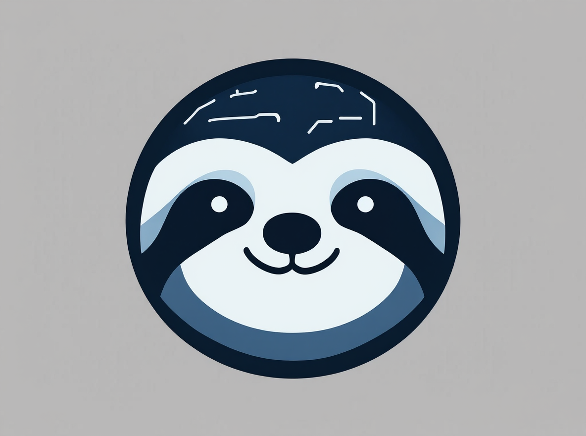
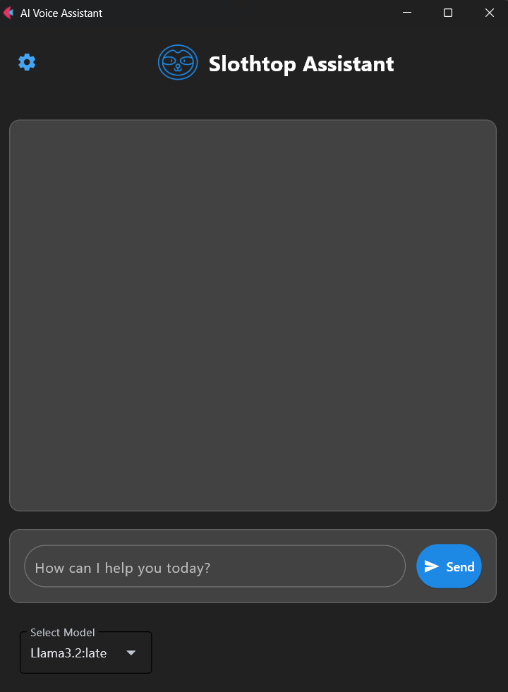
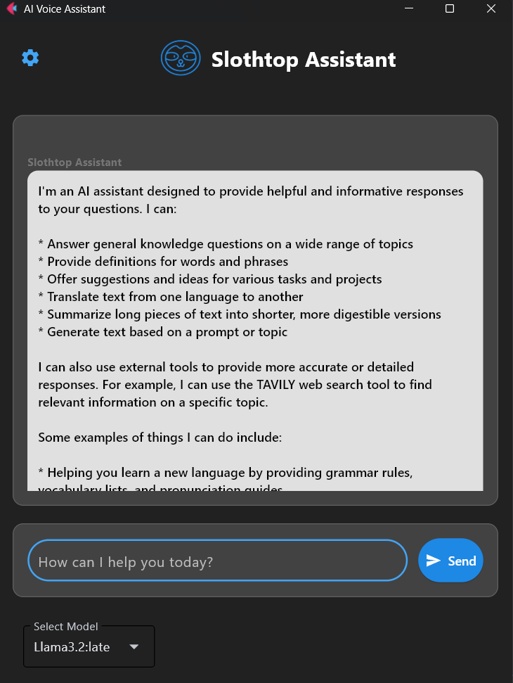

# Slothtop Assistant
<p align="center">
   
</p>

>[!warning] 
>**Project isn't ready yet**, this is only the demo version.

>[!important] 
>This project is **only for Windows** OS :(  

## 🦥About project

This is the project of AI assistant Slothtop. You can chat with him and he will responce to you. Slothtop uses Ollama models and can use tools to do some actions. 

>[!note] 
>If you want, you can take and use this project as a template for your own AI assistants. 
### 🛠Tools:

- Web-search (Tavily API)
- Turn off your PC
- Restart your PC
- Show you the CPU and GPU monitoring pages
- Open and close apps on your PC
****
>[!note] 
> In the future new tools will be added. 

## 🔎Tech Stack
**Python 3.12** 
**Langchain 0.3.26**
**Ollama** 
**Flet 0.28.3**  
**Tavily API**
## 🚀 Getting started locally
### Prerequisites
- **pip** >=24.2
	or 
- **uv** >= 0.6.14
- Supported OS: Windows

### Installation 
1) Clone the repository
```bash
  git clone https://github.com/Lalka00pq/Slothtop-assistant
```

2) Go to the project directory
```bash
  cd slothtop-assistant
```

3) Install project dependencies (using pip or uv)
   Using `pip`:
```bash
  pip install requirements.txt
```
   Using uv
```bash
  uv sync
```

4) Go to [Tavily](https://www.tavily.com/) and set up your API key if you don't have it

5) In the project directory set up your API key in .env_example file (you should rename it to .env)
```env
TAVILY_API_KEY=your-api-key
```

6) Run the project
```bash
  python main.py
```
or
```bash
  uv run main.py
```
## 📸Screenshots
<p align="center">
   <center></center>
   <center></center>
</p>