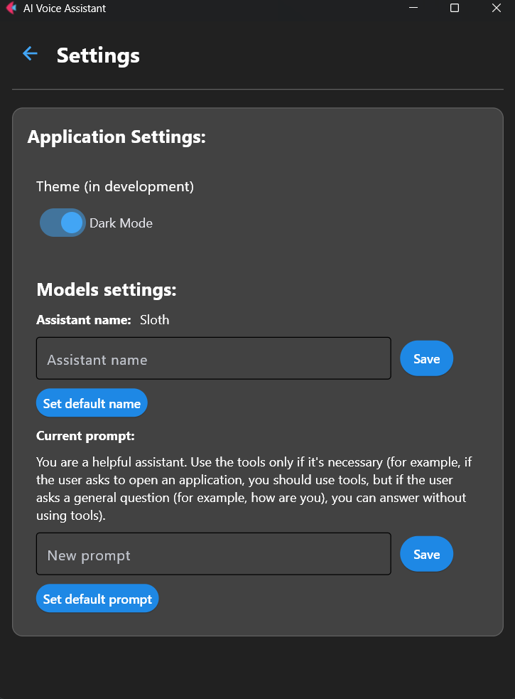

# Slothtop Assistant
<p align="center">
   
</p>

>[!important] 
>New update is here!!!. In 0.3.0v was improved voice recognition. Also agent can check your Internet speed and show information about your PC drives. 

>[!warning] 
>**Project isn't ready yet**, this is only the demo version. The project may contain bugs and critical errors.

>[!important] 
>This project is **only for Windows** OS :(  

## 🦥About project

This is the project of AI assistant Slothtop. You can chat with him and he will response to you. Slothtop uses Ollama models and can use tools to do some actions. 

>[!note] 
>If you want, you can take and use this project as a template for your own AI assistants. 
### 🛠Tools:

- Web-search (Tavily API) (example: Can you find information about sloths)
- Turn off your PC (example: Can you turn off my PC)
- Restart your PC (example: Can you restart my PC)
- Show you the CPU and GPU monitoring pages (example: Start CPU monitoring/Start GPU monitoring)
- Open and close apps on your PC (example: Can you open Obsidian/Firefox and etc, Can you close Obsidian/Firefox and etc)
- Show the weather in cities (Tomorrow API) (example: Show me the weather in New York)
- Show Internet speed (example: Show me the info about my Internet speed)
- Display drives information (example: Show me the info about my drives)
****
>[!note] 
>New tools will be added in the future 

## 🔎Tech Stack
- **Python 3.12** 
- **Langchain 0.3.26**
- **Ollama** 
- **Flet 0.28.3**  
- **Tavily API**
- **Tomorrow API**
## 🚀 Getting started locally
### Prerequisites
- **pip** >=24.2
	or 
- **uv** >= 0.6.14
- Supported OS: Windows
- Install [Ollama](https://ollama.com/) and download at least one model (for example llama3.2)

### Installation 
1) Clone the repository
```bash
  git clone https://github.com/Lalka00pq/Slothtop-assistant
```

2) Go to the project directory
```bash
  cd slothtop-assistant
```
3) Create `venv` in the project directory
```bash
  python -m venv .venv
```
or 
```bash
  uv venv
```
4) Activate venv
```bash
  .venv\Scripts\activate
```
5) Install project dependencies (using pip or uv)
   Using `pip`:
```bash
  pip install requirements.txt
```
   Using uv
```bash
  uv sync
```
6) Go to [Tavily](https://www.tavily.com/) and get your API key if you don't have it
7) Go to [Tomorrow](https://www.tomorrow.io/) and get your API key if you don't have it
8) In the project directory set up your API key in .env_example file (you should rename it to .env)
```env
TAVILY_API_KEY=your-api-key
TOMORROW_API_KEY=your-api-key
```
9) Run the project
```bash
  python main.py
```
or
```bash
  uv run main.py
```
## Settings 
You can change prompt or assistant's name in the settings of the app.
## 📸Screenshots
<p align="center">
   <center></center>
   <center></center>
</p>